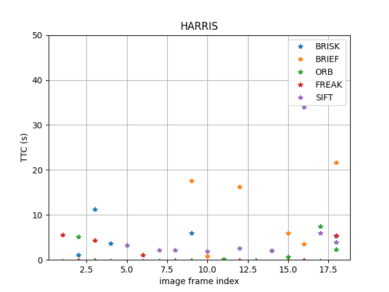
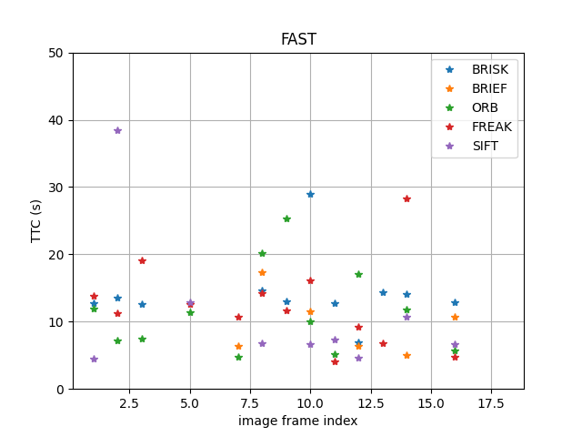
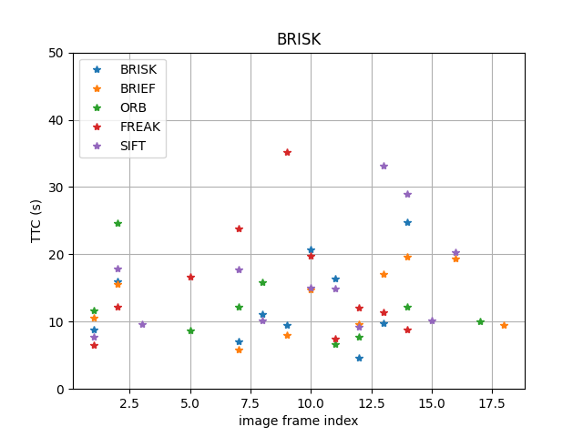
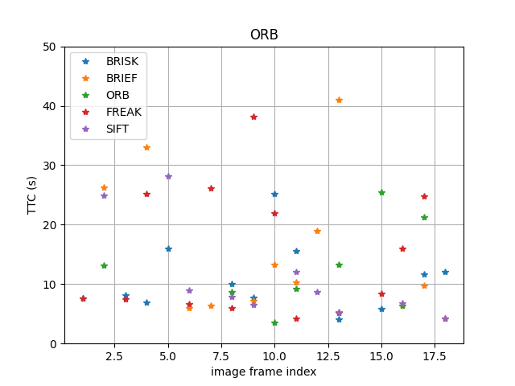
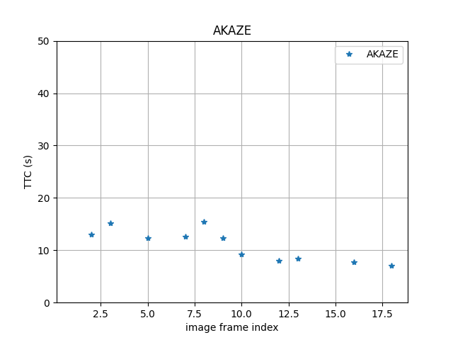

# SFND 3D Object Tracking

Welcome to the final project of the camera course. By completing all the lessons, you now have a solid understanding of keypoint detectors, descriptors, and methods to match them between successive images. Also, you know how to detect objects in an image using the YOLO deep-learning framework. And finally, you know how to associate regions in a camera image with Lidar points in 3D space. Let's take a look at our program schematic to see what we already have accomplished and what's still missing.

In this final project, you will implement the missing parts in the schematic. To do this, you will complete four major tasks: 
1. First, you will develop a way to match 3D objects over time by using keypoint correspondences. 
2. Second, you will compute the TTC based on Lidar measurements. 
3. You will then proceed to do the same using the camera, which requires to first associate keypoint matches to regions of interest and then to compute the TTC based on those matches. 
4. And lastly, you will conduct various tests with the framework. Your goal is to identify the most suitable detector/descriptor combination for TTC estimation and also to search for problems that can lead to faulty measurements by the camera or Lidar sensor. In the last course of this Nanodegree, you will learn about the Kalman filter, which is a great way to combine the two independent TTC measurements into an improved version which is much more reliable than a single sensor alone can be. But before we think about such things, let us focus on your final project in the camera course. 

## Dependencies for Running Locally
* cmake >= 2.8
  * All OSes: [click here for installation instructions](https://cmake.org/install/)
* make >= 4.1 (Linux, Mac), 3.81 (Windows)
  * Linux: make is installed by default on most Linux distros
  * Mac: [install Xcode command line tools to get make](https://developer.apple.com/xcode/features/)
  * Windows: [Click here for installation instructions](http://gnuwin32.sourceforge.net/packages/make.htm)
* Git LFS
  * Weight files are handled using [LFS](https://git-lfs.github.com/)
* OpenCV >= 4.1
  * This must be compiled from source using the `-D OPENCV_ENABLE_NONFREE=ON` cmake flag for testing the SIFT and SURF detectors.
  * The OpenCV 4.1.0 source code can be found [here](https://github.com/opencv/opencv/tree/4.1.0)
* gcc/g++ >= 5.4
  * Linux: gcc / g++ is installed by default on most Linux distros
  * Mac: same deal as make - [install Xcode command line tools](https://developer.apple.com/xcode/features/)
  * Windows: recommend using [MinGW](http://www.mingw.org/)

## Basic Build Instructions

1. Clone this repo.
2. Make a build directory in the top level project directory: `mkdir build && cd build`
3. Compile: `cmake .. && make`
4. Run it: `./3D_object_tracking`.

--------------------------------------------------------------------------------

## FP.1 - Match 3D Objects

I reused the code in the midterm project. I used FLANN similar to industry application and KNN selection.

## FP.2 - Compute LiDAR-based TTC

I firstly removed lidar points comprising outliers in x, y, z directions by the method of Interquartile Ranges ([IQR](https://www.purplemath.com/modules/boxwhisk3.htm)). Afterwards, following the approach in previous exercise. The min distance is used to get the distance to the front car.

## FP.3 - Associate Keypoint Correspondences with Bounding Boxes

I generated a map from (previous_bouding box id, current_bouding box id) to the counts of matches. Next, I found the current bounding box with the highest number of matches for each previous bouding boxes 

## FP.4 - Compute Camera-Based TTC

It is similar to LiDAR-based TTC, the outliers are removed from keypoints. I followed the TTC-calculation in the previous exercise.

## FP.5 - Performance Evaluation 1 - LiDAR-based TTC

The table below shows the TTC estimate at a particular frame index. I used Shi-Tomasi detection with BRISK descriptor extraction. The matches are used for finidng best matchi bouding boxes, thus different detector/descriptor impacts the results of lidar TTC calculation. In image index 1, no lidar point was found for TTC calculation.

| Image Index | TTC LiDAR (in seconds) | 
|:-----------:|:----------------------:|
|      1      |       12.97              |
|      2      |       12.26            |
|      3      |       13.92            |
|      4      |       14.89            |
|      5      |       7.42             |
|      6      |       12.42            |
|      7      |       34.34            |
|      8      |       9.34             |
|      9      |       18.13            | 
|     10      |       18.03            | 
|     11      |       14.99            |
|     12      |       10.10            |   
|     13      |       9.22             |
|     14      |       10.97            |
|     15      |       8.09             |
|     16      |       8.81             | 
|     17      |       10.29            | 
|     18      |       8.52             |

We pay attention to projected lidar points in frame 4 and 5. 
Time-to-collision is definded by distance / relaive velocity. It is important to get a precise relative velocity estimation.
In our approach, we use minimal distance of previous and current lidar points to estimate the relative velocity. The lidar sensor is heavily influenced by noises, and the removing outliers might neglect some correct values.
Using this distance change to estimate relative velocity might be erroneous. Therefore, the TTC calculation might be not plausible.

Secondly, the detector/descriptor influences keypoints match, therefore influences the best match bounding boxes, finally might make the results of lidar TTC calculation infeasible.

## FP.6 - Performance Evaluation 2

I created 7 graphs demonstrating the TTC each possible combination of detectors and descriptors. 
Each graph provides the trend of TTC od one detector along with different descriptors. 

For example, if we look at a matched image (image frame 5) of SHITOMASI detector with BRIEF descriptor, some matched points near around the preceding car are not belonging to it
,but belonging to the car which is far away.
It is also difficult to filter those erroneous matched points.

